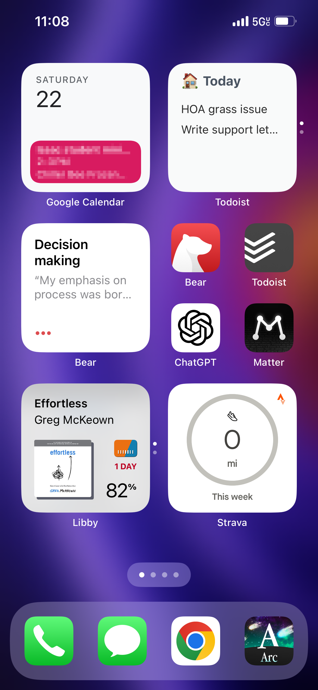

According to my Screen Time statistics I pick up my phone around 50 times (!!) a day. This is often more of a reflex than an intentional decision where I end up “accidentally” doom scrolling Instagram or X or Mastodon. Or even just re-checking my email or Slack that I already checked a few minutes ago and know there can’t possibly be something that important. All of these apps share the common issue of giving me a quick information-filled dopamine hit that distracts me from the things I want to be more intentional about.

I’ve tried many times to “give up” those apps — *I’m totally not checking social media this weekend, really this time* — to varying degrees of success. So now I’m trying to hack that addictive tendency of picking up my phone to steer me towards better habits. It’s kind of like the technique I use in parenting of redirecting my kids’ attention instead of telling them to stop doing something. Or like a twisted version of habit stacking.

The apps that promote better habits can definitely suffer from being out of sight and out of mind. Generally these apps fall into three categories: 

1) Productivity apps that help me capture thoughts or stay on top of my schedule. 
2) Reading apps that encourage me to spend time on higher-quality long-form content like books and articles.
3) Apps that help me learn about something I’m interested in or quickly look up information I need.

By putting these as the first thing that I see when unlocking my phone my hope is to steer myself in the direction of better habits, such as reading a well-written thought-provoking article instead of snacking on social media junk food.

I’ve also turned off all notification badges. I find the red circle to be a singing siren calling on me to look at apps more frequently than necessary. This helps me to be more intentional about my phone usage instead of being snagged by the glaring red dot. It’s never too long before I would check those apps anyways (such as Messages) so I don’t need something distracting me as I attempt to perform a different task.

Ok, I know I’ve built up the suspense with this philosophical talk. You will be relieved to know it is now time to take a tour of my Home Screen and the habits I hope to promote through it. 

*Moving from top left to bottom right (skipping the obvious apps like Phone and Messages).*

1. **Google Calendar widget:** I live by my calendar. I think I would forget most of what’s happening in my life without relying on my calendar. The one thing to note is that I also sync my tasks in Todoist with Google calendar, so it not only tells me when I have a meeting but when I need to do a task I previously planned.
2. **[Todoist](https://todoist.com/) widget stack:** The primary widget shows all tasks that are either overdue or assigned to today without a specific time. The second widget shows all tasks assigned to today. Since my Todoist tasks with a specific time show up on my calendar, I don’t need to see them in my primary view. 
3. **[Bear](https://bear.app/) “random note” widget:** This rotates through random notes under the tag `#knowledge/highlights` which is where I keep highlights from books, articles, podcasts, etc. I’ve found it to be a great way to revisit highlights and notes for things I wanted to remember. Hat tip to [Robert Breen for writing about this idea](https://robertbreen.com/2024/04/30/how-a-hidden-feature-in-bear-changed-the-way-i-review-notes/). Before his post, I didn’t know you could filter that widget based on a tag which makes it so much more useful.
4. **[Bear](https://bear.app/):** This has to be one of my most-used apps on iOS and on my Mac. I put everything in Bear — random thoughts, meeting notes, drafts for emails, even this blog post. I find the act of writing to be an important part of working out my understanding of things, so I am frequently jotting things down to help solidify them in my brain. I could write a whole post how on how I use Bear including my army of Apple Shortcuts that I call to do my bidding. Writing is a Very Good Habit (tm) that I want to make easy for me to do and practice and Bear makes it possible. 
5. **[Todoist](https://todoist.com/):** I’ve used a lot of task apps and Todoist is what has stuck the most with me, particularly for its natural language processing when entering tasks (e.g. “Drink coffee at 8am” — not that I actually need a reminder for that). Any time I think *I need to remember to do this* I have created the habit of throwing that into Todoist. Similar to my reliance on my calendar, I would forget many things without Todoist.
6. **[ChatGPT](https://chatgpt.com/)**: I’m really not sure how ChatGPT fits into my life and workflows right now, but it’s a thing I want to use more of so here it is. I find it to be a helpful tool to get past the “blank canvas” when I’m starting to work on something because I can roughly describe what I’m trying to do and it gives me a good starting point.
7. **[Matter](https://hq.getmatter.com/):** There are many “read it later” type apps but this one is mine. Any article that seems interesting to me gets thrown into Matter. Reading articles about interesting things is so much better for my brain than doom scrolling social media.
8. **[Libby](https://libbyapp.com/) / Kindle widget stack:** Last year I read 20 books and right now, I’m already just past that number. Making it easier to pick up my latest book than opening up social media has greatly increased the number of books I read this year. Picking up more audio books has also helped with that.
9. **[Strava](https://www.strava.com/):** I’m not currently training for a race but I do like to keep a regular habit of running throughout the week. This mileage counter is a helpful reminder to get outside and rapidly move my legs back and forth.
10. **Chrome:** This is my main web browser of choice. Often, if I hear a recommendation of something or think of something I want to research I’ll quickly pop open a tab and do a Google search to revisit later. While I could of course access all manner of time wasting and brain rotting things in a web browser, I find my use of Chrome on mobile to be much more intentional and focused on researching information.
11. **[Arc](https://arc.net/):** Last but not least, Arc has become my go-to app for getting a quick summary about things. There’s a great feature in the app that is AI-powered search where by you enter a search term and it will generate a summary page of the topic along with all references to links used. I use this when I don’t need to go deep on something but just need a quick answer.

And that’s the end of the tour! No doubt you’d agree it was worth the price of admission. 

There are many other apps that I use on my phone, but these are the ones that I believe contribute most to better digital habits. We’ll see how long this one sticks as I’m constantly trying new arrangements.